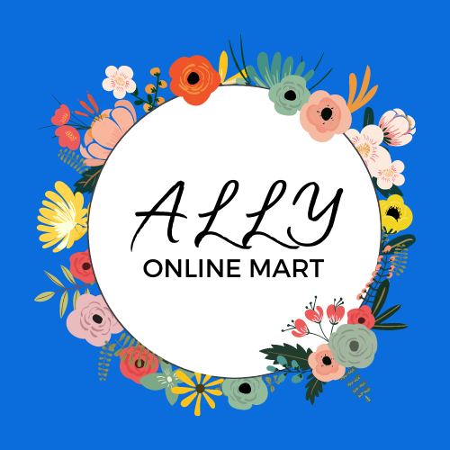
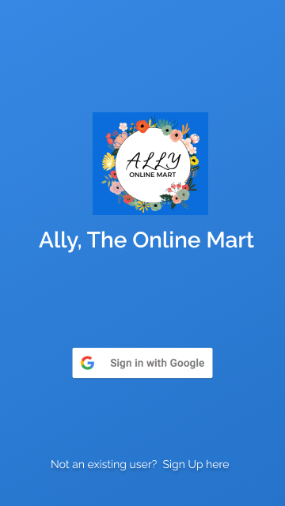
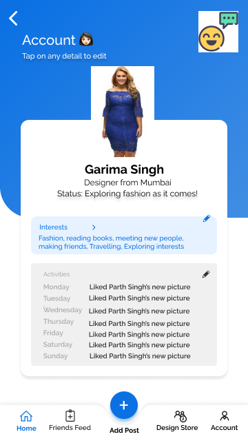
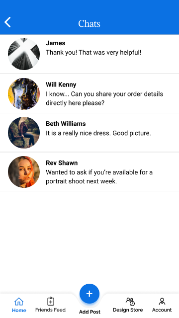
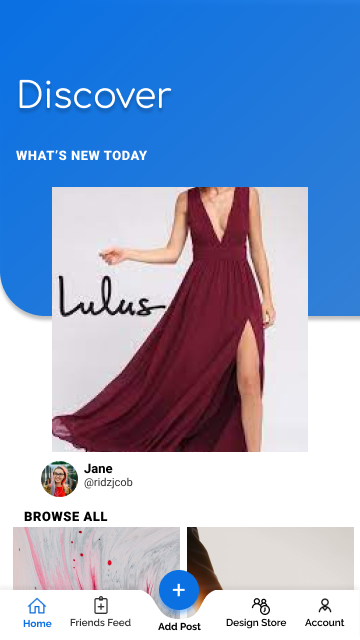
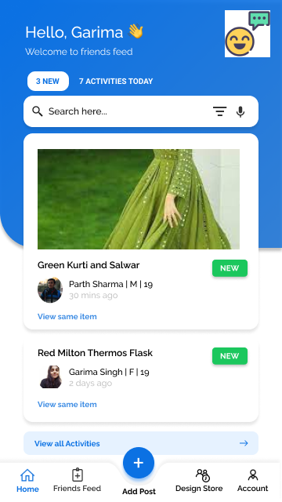
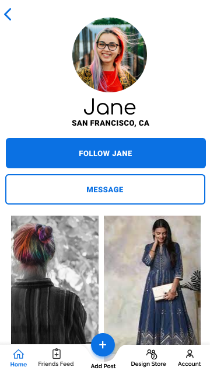



# 👣 Ally- Online Mart
### 🧐 Team Bugs Bunnies ( Customer Delight ) ✨

#### Institute Name: National Institute of Technology Patna
#### Garima Singh : garingh128@gmail.com

## 👩‍ Demo Screenshots

# Problem Statement 👨‍💻
## 👩‍ Customer Delight 
Customer delight is the process of exceeding a customer’s expectations to create a positive customer experience with your product or brand to improve loyalty. Delighting customers is not just meeting their needs at the moment. It is more about building authentic relationships that stand the test of time. Delight is about providing a remarkable experience to users through focusing on their needs, interests, and wishes. Let’s figure out ways to delight our customers by helping them detect personalised trends from various happening and sources throughout India.
Figure out innovative ways to enhance user shopping experience using AR and VR technologies in an ecommerce scenario. Devise innovative ways to incorporate Trends into Fashion relevant flows like Designing and Merchandising

# 🔎 The Idea: Ally The online mart 👣
  Ally is a conjunction that encapsulates effective features that will surely enhance customer satisfaction and delight and create a positive customer base for the brand along with innovative ways to incorporate Trends into Fashion relevant flows like Designing and Merchandising.

- A dedicated news feed section in the mobile application to see what your friends and followed people are buying.
- Feature to follow influencers or your relatives and friends on the app itself and a separate section where top trending influencers and celebrities endorse brands and you can buy the same outfits as them. Famous looks from upcoming movies can also be purchased.
- Add friends and chat option to share your choices and complete cart directly on the app with your online friends with no hassle of sharing links on other apps.
- A separate section where customers can write authoritative, interesting content and blogs in online shop’s contextual domain and get paid for the same. 
- Hyper-personal product recommendations:For individualized service, blending AI and a human touch, style service Thread asks customers to complete a questionnaire and upload images of themselves.

## ✨ Implementation
- Login and sign up component implemented at a small scale through Firebase.
- Discover Section : top trending influencers and celebrities endorse brands
- Chats section
- Friends feed for what your friends are viewing
- Add post or blog

# 🔎 Components of the Android app:
- Activities: Splash screen, Login signup, Discover, Chat, Add post, Account and Friends feed. Smaller components implemented through fragments.
- Services: Broadcasting services and notification intents
- Content providers: For persisting application data, we use SQL and Firebase when online
- Widgets in android: Chat and add post
- Notifications: E-mail pop ups, Messenger popups

# ✨ NLP Model for getting latest fashion trends from Instagram and Facebook
 

## NLP-fashion-trend
Project with my train of thought and analyses carried out to perform Engineering & Modeling of Instagram Data from fashion trending posts.
The document is divided in various sections: 
- Exploratory analysis
- Data cleaning
- Sentiment analysis
- Topic Modeling

# 💻 System Requirements
-  Google Chrome
-  Git
-  Code Editor (Visual Studio Code, Sublime Text, Android Studio)

# Architecture
Model-View-ViewModel architecture that removes the     tight coupling between each component
- Model: It represents the data and the business logic of the Android Application.
- View: It consists of the UI Code(Activity, Fragment), XML. 
- ViewModel: It is a bridge between the View and Model(business logic).

#  💼 Code of Conduct

We want to facilitate a healthy and constructive community behavior by adopting and enforcing our code of conduct.

Please adhere towards our [code-of-conduct.md](code-of-conduct.md).

# 👬 Owner

<a href="https://github.com/garimasingh128"> <b>Garima Singh</b></a> 

# ❤️ In a nutshell: 
SHOPPERS CALL FOR AN 'ALLY' 
AND WE HOPE THAT OUR APP COMPLETES THE CIRCLE.

